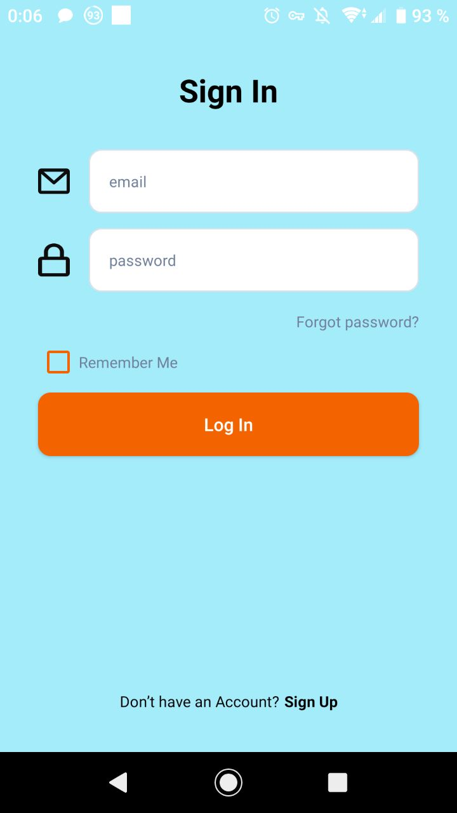

# Android Messenger Application

## Project Description

This project is an Android messenger application developed in Kotlin. The app allows users to exchange text messages seamlessly.

## Used Libraries and Technologies

- Firesrore Database for real-time message exchange.
- Firebase Authentication for user authentication.
- RecyclerView for efficient message list display with paging 3 library
- MVVM (Model-View-ViewModel) architecture for a clean and scalable app design 
- Kotlin Coroutines for asynchronous programming and managing background tasks

## Screenshots

Here are some screenshots of the Android messenger application:

# And also 

In the future, machine learning elements will be added for such functions as: voice control, decryption of voice messages, generation of messages based on a voice request, etc.